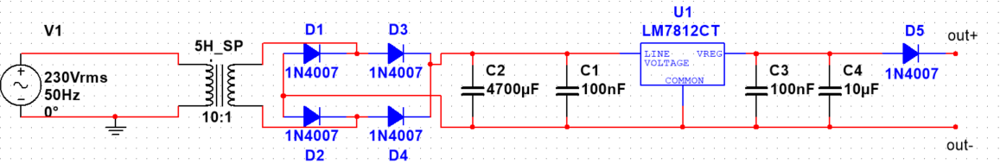

# 12V Regulated DC Power Supply

A classic linear regulated power supply designed in LTspice, converting **230Vrms / 50Hz** mains AC down to a stable **+12V DC** output using the LM7812CT voltage regulator.

---

## Schematic

---

## How It Works

| Stage | Components | Function |
|---|---|---|
| Transformer | 5H_SP (10:1) | Steps 230Vrms down to ~23Vrms |
| Rectifier | D1–D4 (1N4007) | Full-wave bridge rectification |
| Filter | C2 (4700µF), C1 (100nF) | Smooths rectified DC; bulk + HF bypass |
| Regulator | U1 (LM7812CT) | Regulates to +12V DC |
| Output filter | C3 (100nF), C4 (10µF) | Stabilises regulator output |
| Protection | D5 (1N4007) | Reverse-polarity output protection |

### Step-by-step signal flow

1. **V1** provides 230Vrms / 50Hz AC.
2. The **10:1 transformer (5H_SP)** reduces this to ~23Vrms (~32.5V peak).
3. The **bridge rectifier** (D1–D4) converts AC to pulsating DC (~31V after diode drops).
4. **C2 (4700µF)** smooths the bulk ripple; **C1 (100nF)** bypasses high-frequency noise.
5. The **LM7812CT** clamps the output to a steady **+12V**.
6. **C3 (100nF)** and **C4 (10µF)** filter the regulated output for stability.
7. **D5** blocks reverse current from the output side.

---

## Components

| Reference | Part | Value / Notes |
|---|---|---|
| V1 | AC Source | 230Vrms, 50Hz |
| 5H_SP | Transformer | 5H primary, 10:1 ratio |
| D1–D4 | Rectifier diodes | 1N4007 (1A, 1000V) |
| C2 | Bulk capacitor | 4700µF electrolytic |
| C1 | Bypass capacitor | 100nF ceramic |
| U1 | Voltage regulator | LM7812CT (+12V, 1.5A) |
| C3 | Output bypass | 100nF ceramic |
| C4 | Output filter | 10µF electrolytic |
| D5 | Protection diode | 1N4007 |

---

## Electrical Specifications

| Parameter | Value |
|---|---|
| Input voltage | 230Vrms / 50Hz |
| Output voltage | +12V DC (regulated) |
| Max output current | 1.5A (LM7812CT limit) |
| Max output power | ~18W |
| Dropout voltage | ~2V (LM7812CT) |

---

## Simulation

This circuit was designed in **NI Multisim 13**. The project file `powersupply.ms13` is included.

### Screenshots

| Interactive Simulation Settings | Analysis Options | Custom SPICE Options |
|---|---|---|
|  |  |  |

### Running the simulation

1. Open `powersupply.ms13` in Multisim 13 or later.
2. Press **F5** (or go to **Simulate → Run**) to start interactive simulation.
3. Place a **Multimeter** or **Oscilloscope** (from Instruments menu) between `out+` and `out−` to measure the output voltage.

### Simulation settings (already configured in the file)

If you need to adjust settings, go to **Simulate → Interactive Simulation Settings**:

| Setting | Value |
|---|---|
| SPICE options | Use custom settings |
| Max simulation speed | Limited to real time |
| Grapher data | Discard data to save memory |
| Max number of points | 128,000 |
| ABSTOL | 1e-9 A |
| VNTOL | 0.0001 V |
| RELTOL | 0.01 |
| RSHUNT | 1e+12 Ω |
| Convergence assistance (CONVLIMIT) | Enabled |

---

## License

This project is released under the [MIT License](LICENSE).
