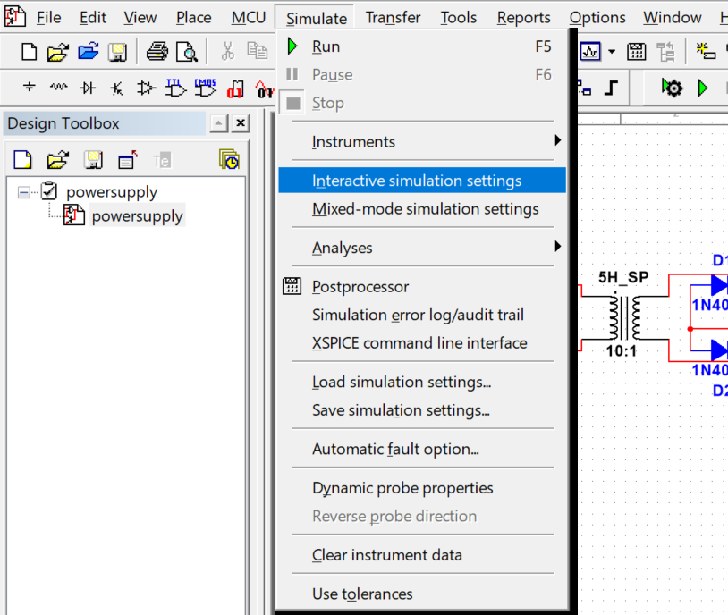
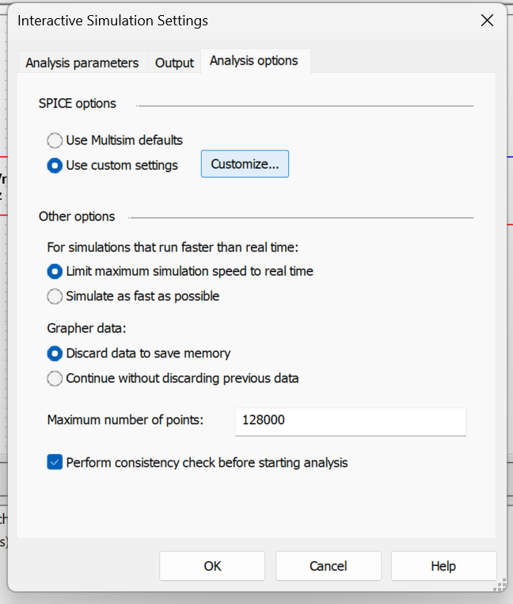
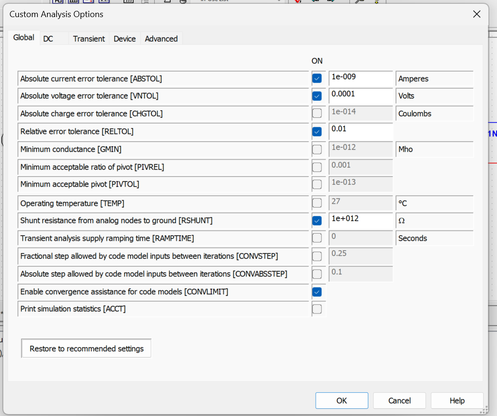

 
# 🔌 12V Regulated DC Power Supply / مزود طاقة تيار مستمر 12 فولت
 

 
---
 

🇬🇧 English

 
A classic linear regulated power supply designed in **NI Multisim 13**, converting **230Vrms / 50Hz** mains AC down to a stable **+12V DC** output using the LM7812CT voltage regulator.
 
### Schematic
 

 
### How It Works
 
| Stage | Components | Function |
|---|---|---|
| Transformer | 5H_SP (10:1) | Steps 230Vrms down to ~23Vrms |
| Rectifier | D1–D4 (1N4007) | Full-wave bridge rectification |
| Filter | C2 (4700µF), C1 (100nF) | Smooths rectified DC; bulk + HF bypass |
| Regulator | U1 (LM7812CT) | Regulates to +12V DC |
| Output filter | C3 (100nF), C4 (10µF) | Stabilises regulator output |
| Protection | D5 (1N4007) | Reverse-polarity output protection |
 
### Step-by-step signal flow
 
1. **V1** provides 230Vrms / 50Hz AC — same as a standard wall outlet.
2. The **10:1 transformer (5H_SP)** reduces this to ~23Vrms (~32.5V peak).
3. The **bridge rectifier** (D1–D4) converts AC to pulsating DC (~31V after diode drops).
4. **C2 (4700µF)** smooths the bulk ripple; **C1 (100nF)** bypasses high-frequency noise.
5. The **LM7812CT** clamps the output to a steady **+12V**.
6. **C3 (100nF)** and **C4 (10µF)** filter the regulated output for stability.
7. **D5** blocks reverse current from flowing back into the system.
 
### Components
 
| Reference | Part | Value / Notes |
|---|---|---|
| V1 | AC Source | 230Vrms, 50Hz |
| 5H_SP | Transformer | 5H primary, 10:1 ratio |
| D1–D4 | Rectifier diodes | 1N4007 (1A, 1000V) |
| C2 | Bulk capacitor | 4700µF electrolytic |
| C1 | Bypass capacitor | 100nF ceramic |
| U1 | Voltage regulator | LM7812CT (+12V, 1.5A) |
| C3 | Output bypass | 100nF ceramic |
| C4 | Output filter | 10µF electrolytic |
| D5 | Protection diode | 1N4007 |
 
### Electrical Specifications
 
| Parameter | Value |
|---|---|
| Input voltage | 230Vrms / 50Hz |
| Output voltage | +12V DC (regulated) |
| Max output current | 1.5A (LM7812CT limit) |
| Max output power | ~18W |
| Dropout voltage | ~2V (LM7812CT) |
 
### Simulation
 
This circuit was designed in **NI Multisim 13**.
 

 
### Video Walkthrough
 
"will be a video here"
 
#### Screenshots
 
| Interactive Simulation Settings | Analysis Options | Custom SPICE Options |
|---|---|---|
|  |  |  |
 
#### Running the simulation
 
1. Open `powersupply.ms13` in Multisim 13 or later.
2. Press **F5** (or go to **Simulate → Run**) to start interactive simulation.
3. Place a **Multimeter** or **Oscilloscope** (from Instruments menu) between `out+` and `out−` to measure the output voltage.
 
#### Simulation settings (already configured in the file)
 
| Setting | Value |
|---|---|
| SPICE options | Use custom settings |
| Max simulation speed | Limited to real time |
| Grapher data | Discard data to save memory |
| Max number of points | 128,000 |
| ABSTOL | 1e-9 A |
| VNTOL | 0.0001 V |
| RELTOL | 0.01 |
| RSHUNT | 1e+12 Ω |
| Convergence assistance (CONVLIMIT) | Enabled |
 

 
---
 

🇩🇿 العربية

 

 
مزود طاقة خطي منظّم مصمَّم ببرنامج **NI Multisim 13**، يحوّل تيار متردد بجهد **230 فولت جذر متوسط مربع / 50 هرتز** إلى تيار مستمر مستقر بجهد **12 فولت** باستخدام منظّم الجهد LM7812CT.
 
### المخطط الكهربائي
 

 
### طريقة عمل الدائرة
 
| المرحلة | المكوّنات | الوظيفة |
|---|---|---|
| المحوّل | 5H_SP (10:1) | يخفّض الجهد من 230 فولت إلى 23 فولت |
| الموجّه | D1–D4 (1N4007) | تحويل التيار المتردد إلى تيار مستمر |
| المرشّح | C2 (4700µF)، C1 (100nF) | تنعيم التيار المستمر وتصفية الترددات العالية |
| المنظّم | U1 (LM7812CT) | تثبيت الجهد عند 12 فولت |
| مرشّح الخرج | C3 (100nF)، C4 (10µF) | تعزيز استقرار جهد الخرج |
| الحماية | D5 (1N4007) | الحماية من عكس القطبية |
 
### شرح تدفق الإشارة خطوة بخطوة
 
1. **المصدر V1** يوفّر تيارًا متردًا بجهد 230 فولت وتردد 50 هرتز — مماثل لمأخذ الكهرباء المنزلي.
2. **المحوّل (5H_SP)** بنسبة 10:1 يخفّض الجهد إلى نحو 23 فولت جذر متوسط مربع (ذروة ~32.5 فولت).
3. **الموجّه الجسري** (D1–D4) يحوّل التيار المتردد إلى تيار مستمر نابض (نحو 31 فولت بعد انخفاض الصمامات).
4. **C2 (4700µF)** يخفّض التموّج الرئيسي؛ **C1 (100nF)** يصفّي الترددات العالية.
5. **LM7812CT** يثبّت جهد الخرج عند **12 فولت** بصورة مستقرة.
6. **C3 (100nF)** و**C4 (10µF)** يعزّزان استقرار الجهد بعد المنظّم.
7. **D5** تمنع عودة التيار إلى الدائرة.
 
### قائمة المكوّنات
 
| المرجع | القطعة | القيمة / ملاحظات |
|---|---|---|
| V1 | مصدر تيار متردد | 230 فولت جذر متوسط مربع، 50 هرتز |
| 5H_SP | محوّل كهربائي | حثّ ابتدائي 5 هنري، نسبة 10:1 |
| D1–D4 | صمامات تقويم | 1N4007 (1 أمبير، 1000 فولت) |
| C2 | مكثّف رئيسي | 4700 ميكروفاراد كهروليتي |
| C1 | مكثّف تجاوز | 100 نانوفاراد سيراميك |
| U1 | منظّم جهد | LM7812CT (12 فولت، 1.5 أمبير) |
| C3 | مرشّح خرج | 100 نانوفاراد سيراميك |
| C4 | مرشّح خرج | 10 ميكروفاراد كهروليتي |
| D5 | صمام حماية | 1N4007 |
 
### المواصفات الكهربائية
 
| المعامل | القيمة |
|---|---|
| جهد الدخل | 230 فولت جذر متوسط مربع / 50 هرتز |
| جهد الخرج | 12 فولت تيار مستمر منظّم |
| أقصى تيار خرج | 1.5 أمبير |
| أقصى قدرة خرج | ~18 واط |
| جهد السقوط | ~2 فولت |
 
### المحاكاة
 
صُمِّمت هذه الدائرة ببرنامج **NI Multisim 13**.
 

 
### شرح فيديو

https://github.com/user-attachments/assets/68a5b7d8-426b-4bd2-81d5-98c172c6e117

 
#### لقطات الشاشة
 
| إعدادات المحاكاة التفاعلية | خيارات التحليل | إعدادات SPICE المخصصة |
|---|---|---|
|  |  |  |
 
#### كيفية تشغيل المحاكاة
 
1. افتح `powersupply.ms13` في Multisim 13 أو إصدار أحدث.
2. اضغط **F5** أو انتقل إلى **Simulate → Run**.
3. ضع **مقياس الجهد** أو **الأوسيلوسكوب** بين `out+` و`out−` لقياس جهد الخرج.
 
#### إعدادات المحاكاة (مضبوطة مسبقًا في الملف)
 
| الإعداد | القيمة |
|---|---|
| خيارات SPICE | إعدادات مخصصة |
| سرعة المحاكاة القصوى | محدودة بالزمن الحقيقي |
| بيانات الرسم البياني | حذف البيانات لتوفير الذاكرة |
| الحد الأقصى لعدد النقاط | 128,000 |
| ABSTOL | 1e-9 أمبير |
| VNTOL | 0.0001 فولت |
| RELTOL | 0.01 |
| RSHUNT | 1e+12 أوم |
| مساعدة التقارب (CONVLIMIT) | مفعّلة |
 

 
---
 
## License
 
This project is released under the [MIT License](LICENSE).
